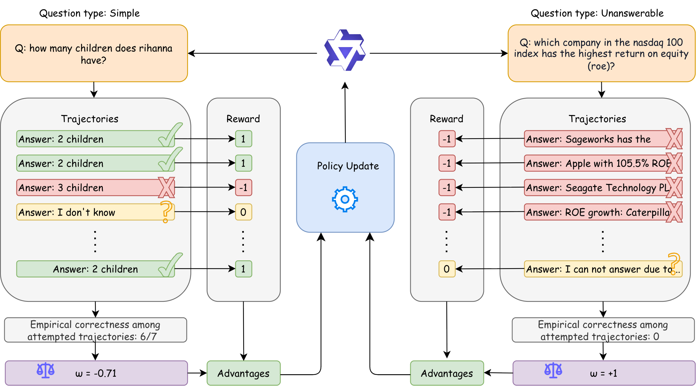

# TIAR: Teaching LLM Abstention through Self-Confidence Estimation and GRPO

This repository contains the official implementation of the paper **"Teaching LLM abstention through self-confidence estimation and Group Relative Policy Optimization" (TIAR)**.
<center>
  
</center>
## Overview

Large Language Models (LLMs) often hallucinate when faced with out-of-knowledge (OOK) queries. **TIAR** addresses this by teaching models to gracefully abstain (e.g., by saying "I don't know") using a novel Reinforcement Learning (RL) approach.

Building upon **Group Relative Policy Optimization (GRPO)** and the ternary reward system (Correct: +1, Wrong: -1, Abstain: 0), TIAR introduces **Trajectory-Informed Advantage Reweighting**. This method dynamically adjusts the abstention reward advantage based on the model's self-estimated confidence across sampled trajectories. By leveraging GRPO's multiple trajectories as a natural signal for uncertainty, TIAR effectively reduces hallucinations without penalizing correct responses.

## Repository Structure

- `data_utils/`: Scripts for data retrieval and preparing OOK questions via knowledge boundary probing.
- `training/`: Core training frameworks.
    - `verl/`: The primary RLHF/GRPO training framework modified to support TIAR's advantage reweighting.
    - `open-r1/`: Additional training utilities and recipes.
- `evaluation/`: Scripts and prompts for the two-stage LLM-as-a-Judge evaluation pipeline.
- `train_sft.sh`: Script for Supervised Fine-Tuning baseline.
- `train_dpo.sh`: Script for Direct Preference Optimization baseline.
- `train_grpo.sh`: Script for launching GRPO and TIAR training runs.

## Installation

We recommend using Conda to manage your environment. The training stack relies on the `verl` framework.

```bash
# Create and activate environment
conda create -n tiar python=3.10 -y
conda activate tiar

# Install core dependencies
pip install -r evaluation/requirements.txt

# Install the modified verl training framework
cd training/verl
pip install -e .
```

## Training

### 1. Supervised Fine-Tuning (SFT)
Trains the baseline with relabeled out-of-knowledge questions:
```bash
bash train_sft.sh
```

### 2. Direct Preference Optimization (DPO)
Trains on preference pairs where "I don't know" is preferred over incorrect answers:
```bash
bash train_dpo.sh
```

### 3. TIAR (GRPO with Advantage Reweighting)
Executes the main TIAR training loop:
```bash
bash train_grpo.sh
```

## Evaluation

The evaluation employs an LLM-as-a-Judge pipeline (Llama-3.1-8B-Instruct) in two stages:
1. **Abstention Classification**: Detects if the model provided an "I don't know" style response.
2. **Factuality Check**: Evaluates the correctness of the answer if the model did not abstain.

```bash
cd evaluation
python evaluate.py --model_path <path_to_model>
```